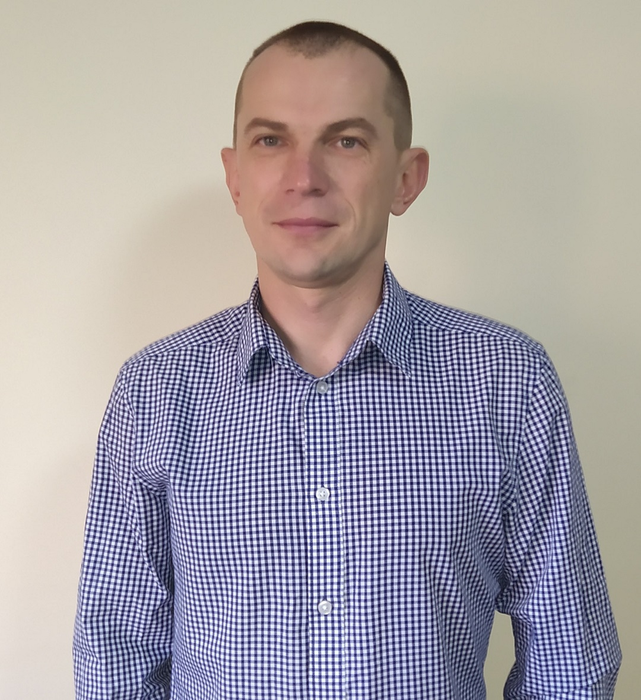

# Roman Shatrov

**Junior Frontend Developer**

**My professional goal is to work as a Frontend Developer. My aim to work in the IT sector , I need constantly development and obtaining an experience, that will stay with me for life. I am currently actively continuing to explore new technologies based on HTML, CSS/SASS, JavaScript. And I want to evolve constantly in frontend technologies, new frameworks and other IT technologies. I realised that have some lacks on practical knowledge and experience on the projects. That is why I am looking for a crew, for whom I will be a useful team member and can develops with their.**

## My testing projects

1. Piggie_Game
2. Web_Bankist
3. Bankist_App_Starter
4. Map_ty

## Employment history

### Beginner - Magnetic Point

January 2021 - April 2021

- Cutting graphic templates from PSD to HTML

### Project Manager - REMONTOWA Electrical Solutions, Gdansk

2018 - 2021

- Manage clients projects. Production, delivery, installation of electrical solutions in onshore/offshore segment.

### Manage clients projects. Production, delivery, installation of electrical solutions in onshore/offshore segments.

- I was responsible for business development and sales.

## Education

### Mgr. Electric, Kiev Politechnical Institute

### Full Stack Developer, Udemy: The Web Developer Bootcamp

2020 - 2021

### Developer JS, Udemy: The Complete JavaScript Course

2021

### CSS - The Complete Guide, Udemy: CSS, SASS

2021

Format: 

Format: 

Designed 2021

Format: 

## Contacts

**Phone: tel:+48 516 416 511**
**E-mail: shat.rom07@gmail.com**
**GitHub: https://github.com/googray**

## Tech skills

### Hard Skills

**I'm use technologies as:**

- HTML
- CSS / SASS
- JavaScript
- Bootstrap
- Git
- Figma

### Soft skills

- Communicative
- Teamwork
- Time management
- Responsibility
- Timeliness

### Languages

- Polish - C1
- English - B2
- Russian - C2
- Ukrainian - C2

Download Resume - automatic!
[GitHub](http://github.com/)

### Hobbies

- Sailing instructor
- Scuba diving
